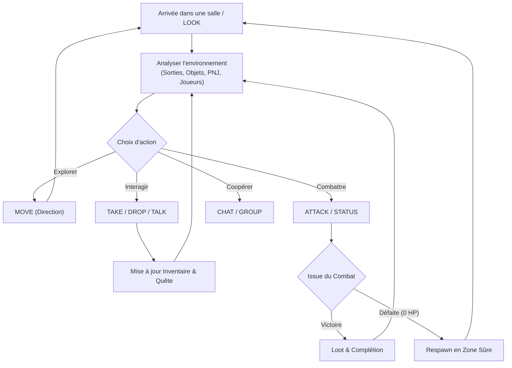

# 02 — Boucle de Gameplay & Règles Fondamentales

## 1. Core Gameplay Loop (Boucle Principale)

La progression du joueur s'articule autour de trois échelles de boucles de gameplay :

### Micro-Loop (Instant par instant)
1. **Observer** : réception des données de la pièce via `LOOK`.
2. **Décider** : choisir une interaction (ramasser un objet, parler à un PNJ, attaquer, se déplacer).
3. **Agir** : envoyer la commande correspondante.
4. **Percevoir** : recevoir la réponse serveur (`OK` ou `ERR`) et les retours d'ambiance.

### Meso-Loop (À l'échelle d'une quête / zone)
1. Parler à un donneur de quête (`TALK <npc>`).
2. Obtenir l'objectif via `QUEST <pnj>`.
3. Explorer les embranchements pour trouver l'objet requis (`TAKE <item>`) ou vaincre l'adversaire (`ATTACK <npc>`).
4. Revenir voir le commanditaire pour valider la quête et recevoir la récompense.

### Macro-Loop (À l'échelle d'une session de jeu)
1. Se connecter au serveur avec un pseudonyme unique (`CONNECT <nom>`).
2. Compléter l'ensemble des quêtes du monde.
3. Découvrir les zones secrètes de la carte.
4. Quitter proprement la session (`QUIT`).

---

## 2. Règles Fondamentales du Monde

### Déplacement & Boussole
- Le monde est organisé en pièces discrètes reliées par des sorties cardinales (`north`, `south`, `east`, `west`) ou verticales (`up`, `down`).
- Les déplacements sont instantanés côté client dès validation par le serveur.
- Chaque mouvement génère des événements de présence pour les témoins :
  - `EVT ROOM PRESENCE LEAVE <pseudo>` (dans l'ancienne salle)
  - `EVT ROOM PRESENCE ENTER <pseudo>` (dans la nouvelle salle)

### Gestion des Objets dans le Monde
- **Unicité stricte** : un objet n'existe qu'en un seul exemplaire à un instant donné.
- **Prise (`TAKE`)** : retire l'objet de la liste des items de la salle et l'ajoute à l'inventaire du joueur. Un événement informe les témoins de la salle.
- **Dépôt (`DROP`)** : retire l'objet de l'inventaire et le dépose au sol dans la salle courante, devenant accessible à tous les autres aventuriers.
- **Résolution des noms** : les objets peuvent être ciblés par leur identifiant technique (ex: `item.golden_key`) ou par leur nom complet insensible à la casse (ex: `Golden Key` ou `golden key`).

### Cycle de Vie d'un Joueur
- **Arrivée** : un joueur apparaît dans la salle définie comme `start` (ex: Place du Village).
- **Points de Vie (HP)** : tout joueur démarre à 100 HP.
- **Mort** : si les HP tombent à 0, le joueur est téléporté immédiatement à la salle de départ avec des PV réduits, et un message est diffusé.
- **Déconnexion** : si un joueur se déconnecte (ou crash), son état est retiré du serveur sans bloquer les autres joueurs ni altérer la persistance en mémoire du monde.
