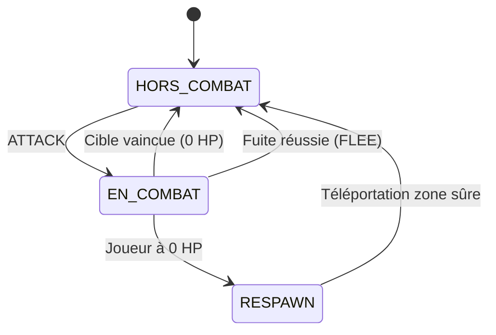

# 03 — Système de Combat

Le sujet exige la conception et l'implémentation d'un système de combat **au tour par tour**, justifié et documenté. Ce document formalise les règles, formules et états du combat.

---

## 1. Principes & États de Combat

Le combat oppose un joueur à un PNJ ennemi situé dans la même pièce.

### Machine à états du joueur
- **HORS_COMBAT** : état normal. Le joueur peut se déplacer, ramasser des objets, discuter.
- **EN_COMBAT** : le joueur est engagé contre une cible spécifique. Ses actions prioritaires sont les commandes de combat (`ATTACK`, `DEFEND`, `FLEE`, `STATUS`).

---

## 2. Commandes de Combat

### `ATTACK <cible>`
- Lance une attaque contre le PNJ désigné.
- Calcule les dégâts infligés par le joueur.
- Déclenche immédiatement la riposte (contre-attaque) de l'ennemi si celui-ci survit.
- Diffuse les résultats de l'action à la salle.

### `STATUS`
- Retourne les points de vie actuels du joueur (ex: `HP: 85/100`), son état (`HORS_COMBAT` ou `EN_COMBAT`) et, si en combat, le nom et les HP restants de la cible.

### `DEFEND` *(Extension de Game Design)*
- Le joueur adopte une posture défensive pour le tour en cours.
- Réduit de 50 % les dégâts de la prochaine attaque ennemie.
- Permet de temporiser face à un adversaire puissant ou en attendant du renfort.

### `FLEE` *(Extension de Game Design)*
- Tentative d'interruption du combat et de fuite vers une issue accessible aléatoire.
- Taux de réussite : 70 %.
- En cas d'échec : l'ennemi porte une attaque d'opportunité gratuite (dégâts normaux).

---

## 3. Initiative & Déroulement d'un Tour

1. **Déclaration de l'action** : Le joueur envoie une commande (`ATTACK`, `DEFEND` ou `FLEE`).
2. **Phase d'attaque joueur** :
   - Si `ATTACK` : calcul et soustraction des dégâts sur les HP du PNJ.
   - Vérification de la mort du PNJ (HP ≤ 0).
3. **Phase de riposte ennemie** (si PNJ toujours vivant) :
   - Calcul des dégâts infligés par le PNJ sur le joueur.
   - Application des modificateurs (ex: réduction si `DEFEND`).
   - Vérification des HP du joueur (HP ≤ 0 -> Défaite/Respawn).
4. **Diffusion des événements (`EVT`)** :
   - Le serveur envoie à la salle un résumé de l'échange de coups.

---

## 4. Formules de Dégâts & Équilibrage

### Formule des dégâts du joueur
$$\text{Dégâts}_{\text{joueur}} = \text{Dégâts de base} + \text{Bonus d'arme} \pm \text{Aléatoire}$$
- Dégâts à mains nues : $10 \text{ à } 15$ PV.
- Dégâts avec arme dans l'inventaire (ex: Épée rouillée) : $+10$ PV supplémentaires.

### Formule des dégâts ennemis
$$\text{Dégâts}_{\text{ennemi}} = \text{Attaque PNJ} \pm \text{Aléatoire}$$
- Si le joueur a utilisé `DEFEND` : $\text{Dégâts subis} = \lfloor \text{Dégâts}_{\text{ennemi}} \times 0.5 \rfloor$.

### Table d'équilibrage des Ennemis

| Ennemi | HP | Dégâts / tour | Rôle & Difficulté |
|---|---|---|---|
| **Rat Géant** | 25 HP | 5 - 8 PV | Tutoriel / Faible |
| **Bandit de Grand Chemin** | 50 HP | 12 - 18 PV | Intermédiaire (nécessite prudence) |
| **Garde Corrompu / Boss** | 90 HP | 20 - 28 PV | Difficile (nécessite une arme ou DEFEND) |

---

## 5. Mort, Défaite et Respawn

- **Seuil critique** : Dès qu'un joueur atteint $0$ HP :
  1. Il est déclaré vaincu.
  2. Un événement `EVT ROOM CHAT "Le joueur <nom> a succombé face à <ennemi>"` est diffusé aux témoins de la salle.
  3. Le joueur est immédiatement déplacé vers la salle de départ (`start` / Place du Village).
  4. Ses HP sont restaurés à **30 HP** (valeur réduite pour refléter l'échec, conformément au sujet).
  5. Il quitte l'état `EN_COMBAT`.
