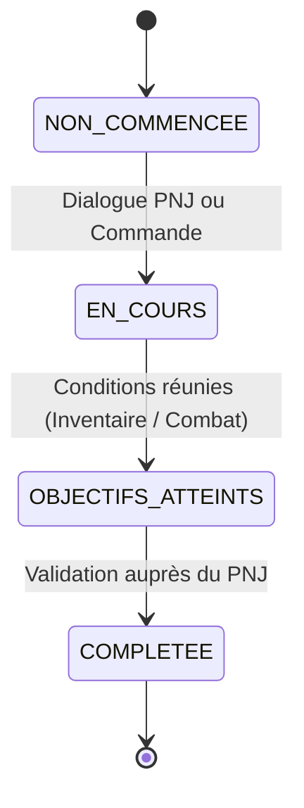

# 04 — Système de Quêtes

Le sujet impose la présence d'au moins **2 quêtes distinctes** (par exemple : collecte d'objet, livraison, élimination d'un ennemi) avec un système de progression, de validation et de récompenses conçu par le groupe.

---

## 1. Machine à États d'une Quête

Chaque quête suit un cycle de vie bien défini pour chaque joueur :

### États
- `NON_COMMENCEE` : Quête disponible dans le monde auprès d'un donneur de quête.
- `EN_COURS` : Le joueur a accepté la quête. Le serveur suit ses actions (objets ramassés, ennemis battus).
- `OBJECTIFS_ATTEINTS` : Les conditions techniques sont remplies mais la quête doit être clôturée.
- `COMPLETEE` : Clôture définitive, récompense accordée, quête non rejouable.

---

## 2. Commandes Protocolaire Liées aux Quêtes

- `QUESTS` : Renvoie la liste des quêtes connues du joueur ainsi que leur statut actuel (`NON_COMMENCEE`, `EN_COURS`, `COMPLETEE`).
- `QUEST <quest_id>` : Affiche la description détaillée de la quête demandée, l'objectif en cours et le commanditaire.

---

## 3. Typologie des Objectifs Pris en Charge

Le moteur de quêtes gère 3 catégories d'objectifs :

1. **FETCH (Collecte)** : Posséder un item spécifique dans l'inventaire (ex: `item.old_key`).
2. **DELIVER (Livraison)** : Donner un item requis à un PNJ cible via une interaction (`TALK <npc>`).
3. **DEFEAT (Élimination)** : Vaincre un PNJ hostile spécifique (ex: `npc.bandit_chief`).

---

## 4. Fiches Détaillées des Deux Quêtes Obligatoires

### Quête 1 : « Le Remède de l'Apothicaire » (Type : Fetch & Deliver)

- **ID Technique** : `quest.herbal_cure`
- **Donneur de quête** : L'Herboriste (salle : `loc.herbalist_shop`)
- **Pitch narratif** : L'herboriste a besoin d'herbes médicinales rares qui ne poussent que dans le jardin abandonné derrière le manoir.
- **Étapes** :
  1. Parler à l'Herboriste (`TALK herbalist`) pour enclencher la quête.
  2. Trouver et ramasser les herbes rares (`TAKE rare_herbs` dans `loc.overgrown_garden`).
  3. Retourner voir l'Herboriste et lui parler (`TALK herbalist`).
- **Validation** : Le serveur vérifie que le joueur possède `item.rare_herbs` dans son inventaire lors de l'interaction. L'item est consommé.
- **Récompense** :
  - Restauration complète des PV (100 HP).
  - Remise d'un objet unique : une Fiole de Vigueur (`item.vigor_potion`).

---

### Quête 2 : « La Chasse au Coupe-Gorge » (Type : Defeat & Report)

- **ID Technique** : `quest.bandit_bounty`
- **Donneur de quête** : Le Capitaine de la Garde (salle : `loc.town_gate`)
- **Pitch narratif** : Un bandit de grand chemin s'est retranché dans les ruines et détrousse les marchands. Le capitaine offre une prime pour son élimination.
- **Étapes** :
  1. Parler au Capitaine de la Garde (`TALK guard_captain`) pour accepter la prime.
  2. Se rendre dans les ruines (`loc.ruins_den`) et engager le combat contre le chef bandit (`ATTACK bandit_leader`).
  3. Vaincre le chef bandit au combat au tour par tour.
  4. Retourner faire son rapport au Capitaine (`TALK guard_captain`).
- **Validation** : Le serveur enregistre la victoire contre `npc.bandit_leader` dans l'état de quête du joueur.
- **Récompense** :
  - Déblocage de l'accès à une issue secrète ou remise d'une Clé Ancienne (`item.ancient_key`) ouvrant la crypte du donjon.

---

## 5. Gestion des Cas Particuliers & Triche

- **Perte de l'objet de quête** : Si un joueur jette (`DROP`) l'objet de quête avant validation, le statut repasse automatiquement à l'étape précédente.
- **Concurrence multijoueur sur les items de quête** : Comme les objets sont uniques dans le monde, si un joueur A possède les herbes, le joueur B doit attendre qu'il les rende ou que le monde se réinitialise.
- **Quête déjà terminée** : Réponse informative du PNJ confirmant que la mission est déjà accomplie pour ce joueur.
