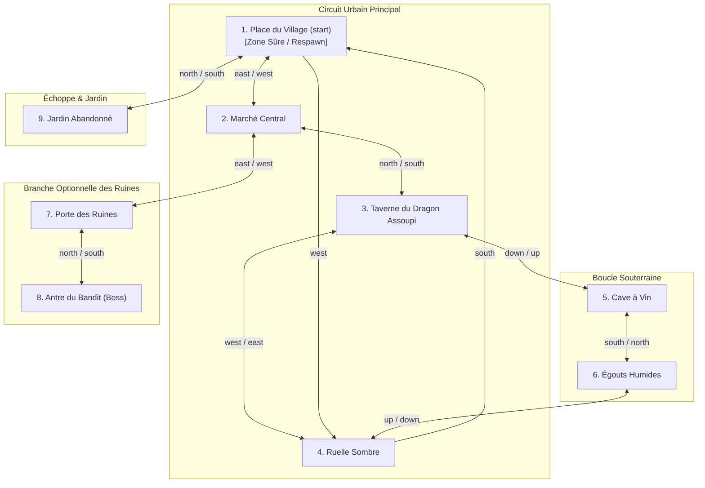

# 05 — World Design & Topologie du Monde

Le sujet impose un monde cohérent d'au moins **8 salles interconnectées**, comportant au moins **une boucle** (exploration circulaire complète) et au moins **une branche optionnelle**.

---

## 1. Topologie de la Carte (Graphe du Monde)

Le monde proposé compte **9 salles interconnectées** pour dépasser confortablement le minimum requis :
- **Une grande boucle principale (circuit)** : `Square` -> `Market` -> `Tavern` -> `Back_Alley` -> `Square`
- **Une boucle secondaire** : `Tavern` -> `Cellar` -> `Sewers` -> `Back_Alley`
- **Une branche optionnelle (impasse / donjon)** : `Market` -> `Ruins_Entrance` -> `Ruins_Den` (antre du bandit)



---

## 2. Dictionnaire Détaillé des Salles

### Salle 1 : Place du Village (`loc.town_square`) — *Start / Safe Zone*
- **Nom affiché** : Place du Village
- **Description** : Une vaste place pavée baignée d'une lumière douce. Au centre trône une fontaine de pierre où l'eau clapote paisiblement. Des aventuriers s'y rassemblent avant de partir en expédition.
- **Sorties** : `east: loc.market`, `north: loc.garden`, `west: loc.dark_alley`
- **Objets initiaux** : Fontaine de Pierre (`item.fountain`)
- **PNJ présents** : Garde du Village (`npc.guard`)
- **Propriété** : Zone de respawn après la mort.

### Salle 2 : Marché Central (`loc.market`)
- **Nom affiché** : Marché Central
- **Description** : Des étals d'étoffes, d'épices et d'outils s'alignent le long de l'allée commerçante. L'odeur du pain chaud et des fruits mûrs flotte dans l'air.
- **Sorties** : `west: loc.town_square`, `north: loc.tavern`, `east: loc.ruins_gate`
- **Objets initiaux** : Pomme Fraîche (`item.apple`)
- **PNJ présents** : Marchand Ambulant (`npc.merchant`)

### Salle 3 : Taverne du Dragon Assoupi (`loc.tavern`)
- **Nom affiché** : Taverne du Dragon Assoupi
- **Description** : Une salle chaleureuse éclairée par un grand feu de cheminée. Le plancher grince sous les pas et une trappe mène au sous-sol.
- **Sorties** : `south: loc.market`, `west: loc.dark_alley`, `down: loc.cellar`
- **Objets initiaux** : Chope de Bière (`item.ale`)
- **PNJ présents** : Tavernier Jovial (`npc.innkeeper`)

### Salle 4 : Ruelle Sombre (`loc.dark_alley`)
- **Nom affiché** : Ruelle Sombre
- **Description** : Un passage étroit entre de hauts murs de brique humide. L'obscurité y est épaisse et une grille d'égout béante laisse monter une odeur fétide.
- **Sorties** : `south: loc.town_square`, `east: loc.tavern`, `down: loc.sewers`
- **Objets initiaux** : Épée Rouillée (`item.rusty_sword`)
- **PNJ présents** : Voleur à la Tire (`npc.thief`)

### Salle 5 : Cave à Vin (`loc.cellar`)
- **Nom affiché** : Cave de la Taverne
- **Description** : De gros tonneaux de chêne s'empilent dans l'ombre. De la poussière recouvre les bouteilles rangées sur les étagères. Un passage dérobé semble s'ouvrir vers le sud.
- **Sorties** : `up: loc.tavern`, `south: loc.sewers`
- **Objets initiaux** : Torche Éteinte (`item.torch`)
- **PNJ présents** : *aucun*

### Salle 6 : Égouts Humides (`loc.sewers`)
- **Nom affiché** : Égouts de la Ville
- **Description** : Un canal d'eaux usées bordé par un rebord glissant. Des clapotis résonnent dans le lointain et des yeux luisants vous observent depuis les recoins.
- **Sorties** : `north: loc.cellar`, `up: loc.dark_alley`
- **Objets initiaux** : *aucun*
- **PNJ présents** : Rat Géant (`npc.giant_rat`)

### Salle 7 : Porte des Ruines (`loc.ruins_gate`)
- **Nom affiché** : Porte des Ruines Extérieures
- **Description** : Une arche de pierre effondrée marquant l'entrée d'anciennes fortifications oubliées. Les ronces ont envahi les pavés fêlés.
- **Sorties** : `west: loc.market`, `north: loc.ruins_den`
- **Objets initiaux** : Bouclier Fendu (`item.wooden_shield`)
- **PNJ présents** : Capitaine de la Garde (`npc.guard_captain`)

### Salle 8 : Antre du Bandit (`loc.ruins_den`) — *Branche optionnelle & Boss*
- **Nom affiché** : Antre du Coupe-Gorge
- **Description** : Un campement de fortune aménagé sous une voûte de pierre brisée. Un feu de camp crépite au milieu de caisses pillées. L'atmosphère est lourde et hostile.
- **Sorties** : `south: loc.ruins_gate`
- **Objets initiaux** : Coffre Mystérieux (`item.mystery_chest`)
- **PNJ présents** : Chef des Bandits (`npc.bandit_leader`)

### Salle 9 : Jardin Abandonné (`loc.garden`)
- **Nom affiché** : Jardin Abandonné
- **Description** : Une enclave de verdure sauvage où la nature a repris ses droits. De vieux parterres de fleurs côtoient des buissons épineux et des herbes aromatiques.
- **Sorties** : `south: loc.town_square`
- **Objets initiaux** : Herbes Rares (`item.rare_herbs`)
- **PNJ présents** : Herboriste (`npc.herbalist`)

---

## 3. Schéma de Données (JSON)

Le serveur charge `data/world.json`. Ce fichier contient le catalogue des objets uniques dans `world.items` et leur placement initial dans `world.locations.<id>.items`. Chaque objet doit être déclaré une seule fois et placé dans exactement une salle, ou explicitement réservé via `initial_location: {"kind":"reserve"}`. Les objets réservés sont absents du sol et des inventaires. Le chargement refuse les IDs inconnus, les doublons, les placements manquants et les objets simultanément réservés et placés.

Les identifiants suivent la [convention du protocole](../protocol/rfc_syntax.md) : `loc.*` pour les salles, `item.*` pour chaque instance physique unique, `npc.*` pour les PNJ et `quest.*` pour les quêtes. Ils sont stables, uniques, en ASCII minuscule avec `_` entre les mots ; les noms affichés restent du texte UTF-8. Deux exemplaires d'un objet reçoivent deux IDs différents, par exemple `item.apple_1` et `item.apple_2`.

Exemple minimal du format chargé :

```json
{
  "world": {
    "start": "loc.town_square",
    "items": [
      {"id": "item.apple", "name": "Pomme fraîche", "obtainable": true}
    ],
    "npcs": [
      {"id": "npc.guard", "name": "Garde du Village", "role": "dialogue", "dialogue": "Restez sur vos gardes, voyageur."}
    ],
    "locations": {
      "loc.town_square": {
        "name": "Place du Village",
        "description": "Une vaste place pavée.",
        "exits": {"north": "loc.garden"},
        "items": ["item.apple"],
        "npcs": ["npc.guard"]
      },
      "loc.garden": {
        "name": "Jardin",
        "description": "Un jardin paisible.",
        "exits": {"south": "loc.town_square"},
        "items": [],
        "npcs": []
      }
    }
  }
}
```

`obtainable: false` permet d'afficher un objet fixe dans `LOOK` tout en refusant `TAKE`. Les noms sont du texte UTF-8 sur une seule ligne, sans tabulation ni espaces en début ou fin.

Le fichier actuel intègre les neuf salles du monde du Dev B, dix objets uniques, huit PNJ et deux définitions de quête. Il constitue la référence pour les changements de gameplay. `Project/data/world.yaml` conserve la proposition initiale, sans être chargé par le serveur. Le monde de test précédent est conservé dans `internal/server/testdata/two_rooms.json`. Les noms et descriptions du monde actif sont en anglais, comme dans la proposition du Dev B. Les noms français des fiches sont des traductions de conception.

Le catalogue `world.npcs` contient les champs `id`, `name`, `role` et `dialogue` (chaîne UTF-8 non vide ou tableau ordonné non vide de chaînes non blanches). Chaque PNJ doit être déclaré une fois et placé dans exactement une salle via sa liste `npcs`. Le chargement refuse les références inconnues, les doublons, les IDs invalides et les PNJ sans salle. Les noms suivent les mêmes règles que ceux des objets. `role` vaut `dialogue`, `quest_giver` ou `enemy`. Les répliques du tableau sont jointes par un saut de ligne, échappé dans le JSON réseau. Le dialogue complet est fixe et privé au joueur qui utilise `TALK` ; la livraison à un donneur peut consommer un ingrédient et attribuer une récompense ; le combat, les quêtes et leurs statuts sont implémentés.

Pendant l'exécution, le serveur conserve une position unique par objet : une salle, une réserve, un état consommé ou l'inventaire d'un joueur. `TAKE` et `DROP` modifient cette position ; `LOOK` et `INVENTORY` lisent l'état courant. À la déconnexion, les objets portés sont déposés dans la salle actuelle du joueur. Un redémarrage recharge les placements initiaux du fichier.

### Métadonnées, respawn et données futures

`world.metadata` conserve le nom et la version du monde. `world.start` désigne
la salle de connexion et `world.respawn` la salle de retour après une
défaite ; si absent, `respawn` prend la valeur de `start`. Les deux références
sont validées. Le combat y renvoie le joueur avec 30 PV en cas de défaite.

Les placements `spawns: [{npc_id, count: 1}]` de la proposition YAML deviennent
`npcs: [npc_id]`. Plusieurs instances exigeraient plusieurs IDs uniques.
Les catalogues JSON sont des tableaux avec un champ `id` explicite.

Les attributs d'objets (`description`, `type`, `heal_value`, `damage_bonus`,
`defense_bonus`) et de PNJ (`description`, `hp`, `max_hp`, `attack_power`,
`hostile`) sont conservés dans les modèles. Les bonus et PV sont non négatifs,
et les PV initiaux ne dépassent pas les PV maximum. `world.quests` conserve
les définitions JSON et valide leurs types, donneurs, cibles et récompenses.
Les livraisons fetch_and_deliver sont exécutées via TALK ; la progression est consultable via QUESTINFO/QUESTS et defeat_and_report vérifie
la victoire enregistrée par le moteur de combat. Les réponses de `LOOK` restent limitées aux descripteurs du
protocole ; ces attributs supplémentaires ne sont pas envoyés implicitement.

`item.ancient_key` et `item.vigor_potion` commencent en réserve. La potion est attribuée une seule fois par monde lors de la livraison
des herbes à l'herboriste ; la clé est attribuée après une victoire réelle sur le bandit et un rapport au capitaine. Les objets uniques ne sont pas dupliqués par cette intégration.

La carte conserve les sorties dirigées de Novanns : `west` depuis la place
mène à la ruelle, `south` depuis la ruelle retourne à la place et `east` depuis
la ruelle mène à la taverne. Le serveur n'impose pas de sorties réciproques.

Les consommables sont obtenables avec un heal_value strictement positif.
USE soigne et les rend consommés, sans les recréer avant redémarrage. Une
récompense doit être un objet obtenable réservé, référencé par une seule
quête. Un donneur ne peut avoir qu'une livraison automatique pour éviter
l'ambiguïté de TALK. Le chargement refuse les références manquantes et les
statistiques invalides avant toute ouverture du port TCP.
