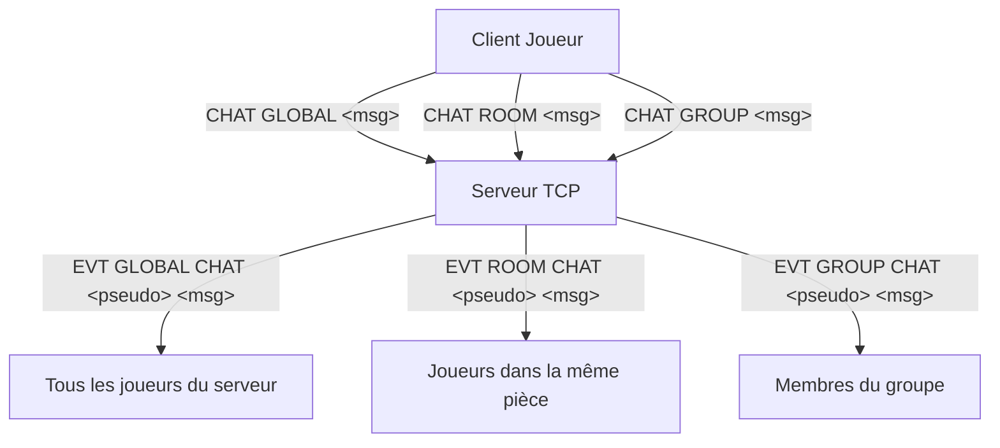

# 07 — Multijoueur & Interactions Sociales

Le jeu fonctionne comme un monde partagé persistant où plusieurs aventuriers connectés simultanément interagissent, se croisent et communiquent en temps réel.

---

## 1. Canaux de Communication (Système de Chat)

Le protocole prévoit 3 canaux de discussion isolés pour adapter la portée des messages :



### Canal 1 : `GLOBAL` (Tout le serveur)
- **Syntaxe** : `CHAT GLOBAL <message>`
- **Portée** : Tous les joueurs actuellement connectés au serveur, quelle que soit leur position.
- **Usage** : Appels généraux, annonces, salutations globales.

### Canal 2 : `ROOM` (Local / Proximité)
- **Syntaxe** : `CHAT ROOM <message>`
- **Portée** : Uniquement les joueurs situés dans la même salle que l'émetteur.
- **Usage** : Rôleplay de proximité, coordination tactique immédiate, échanges privés au comptoir de la taverne.

### Canal 3 : `GROUP` (Escouade / Groupe)
- **Syntaxe** : `CHAT GROUP <message>`
- **Portée** : Uniquement les membres appartenant au même groupe que l'émetteur.
- **Usage** : Coordination de combat ou d'exploration à distance entre alliés.

---

## 2. Détection de Présence & Visibilité

### Événements de Présence
Dès qu'un joueur change de salle via `MOVE <direction>`, deux événements asynchrones sont envoyés :
1. Aux joueurs restants dans l'ancienne salle :  
   `EVT ROOM PRESENCE LEAVE <pseudo>`
2. Aux joueurs déjà présents dans la salle de destination :  
   `EVT ROOM PRESENCE ENTER <pseudo>`

### Commande `WHO`
Permet à tout moment d'obtenir la visibilité sur la communauté :
- Joueurs présents dans la salle courante.
- Nombre total de joueurs connectés sur le serveur.
- Exemple de retour serveur :
  ```json
  OK { "room": ["alice", "bob"], "server": 5 }
  ```

---

## 3. Système de Groupe (`GROUP`)

Le système de groupe permet à 2 joueurs ou plus de former une escouade :
- `GROUP CREATE <nom_groupe>` : Création d'une escouade.
- `GROUP JOIN <nom_groupe>` : Rejoindre un groupe existant.
- `GROUP LEAVE` : Quitter son groupe actuel.
- **Avantages de jeu** : accès au canal `CHAT GROUP` et partage possible des informations de quête.

---

## 4. Gestion de la Concurrence & Déconnexions

- **Déconnexion propre (`QUIT`)** ou abrupte (fermeture de socket) :
  - Le serveur libère immédiatement la place du joueur.
  - Retrait du joueur de la salle.
  - Broadcast immédiat `EVT ROOM PRESENCE LEAVE <pseudo>` aux joueurs voisins.
  - Le serveur continue d'émettre aux autres clients sans aucun crash ni interruption de flux.
