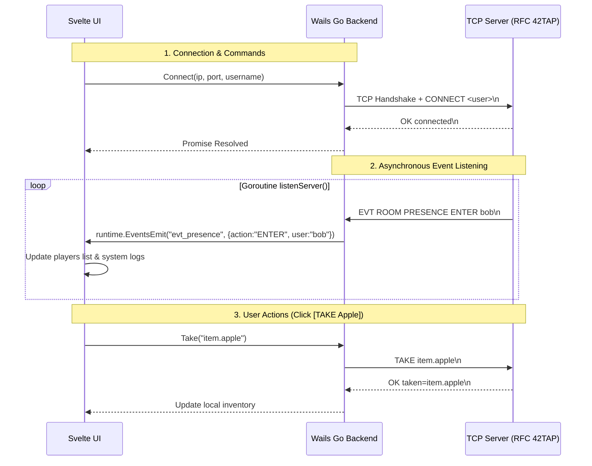

# GUI Client Specifications

> **Document Status**: `🟢 VALIDATED`  
> **Assigned to**: Novanns (Dev B)  
> **Last Updated**: 2026-10-07

The GUI client provides an accessible, rich visual experience for the TAP adventure. It must remain interchangeable with the CLI client and strictly follow the RFC 42TAP protocol over a TCP connection.

---

## 1. GUI Toolkit Selection `🟢 VALIDATED`

The 42 subject permits any real graphical toolkit (curses is forbidden).

| Toolkit Candidate | Language | Pros | Cons / Dependencies |
|---|---|---|---|
| **Fyne** | Go | Pure Go, clean widgets, cross-platform, fast setup | Requires OpenGL/CGo drivers |
| **Wails (Webview / Svelte / React)** | Go + HTML/CSS | Modern CSS styling, easy layout and tab handling, fast reactivity | Webview runtime required |
| **GTK+ / Qt** | Go bindings / C++ | Native OS look, comprehensive widgets | Heavy CGo bindings & library install |

> **Decision**: `🟢 VALIDATED` — **Wails v2 (v2.16.0) with Svelte & Vite**.  
> **Rationale**:
> - **Separation of Concerns**: Networking, TCP framing, and state synchronization are cleanly handled in Go (satisfying systems programming requirements), while UI rendering uses modern reactive HTML5/CSS3.
> - **Ergonomics & Subject Compliance**: Seamless tab separation for Chat channels (*Global*, *Room*, *Group*, *Logs*) as explicitly mandated by subject Chapter V.4.
> - **Lightweight State Binding**: Svelte provides frictionless two-way data binding without heavy virtual DOM overhead.
> - **Event Streaming**: Built-in Wails runtime event bus (`runtime.EventsEmit` / `runtime.EventsOn`) directly bridges asynchronous server `EVT` packets to the frontend.

---

## 2. Component Layout & Visual Hierarchy

```text
+-------------------------------------------------------------------------------+
| Header: Server IP:Port | Player: Alice | Room Players: 2 | Server Players: 6  |
+---------------------------------------+---------------------------------------+
| [ROOM VIEW]                           | [CHARACTER & INVENTORY]               |
| Name: Village Square                  | Health: [████████░░] 80/100 HP        |
| Description: A lively cobblestone...  | Status: HORS_COMBAT                   |
|                                       | Inventory:                            |
| Available Exits:                      | - Rusty Sword        [ DROP ]         |
| [ North: Garden ] [ East: Market ]    | - Rare Herbs         [ DROP ]         |
+---------------------------------------+---------------------------------------+
| [ROOM ENTITIES]                       | [QUEST TRACKER]                       |
| Items on ground:                      | Active: The Apothecary's Remedy       |
| - Fresh Apple           [ TAKE ]      | Objective: Bring herbs to Herbalist   |
| NPCs present:                         |                                       |
| - Village Guard         [ TALK ]      |                                       |
+---------------------------------------+---------------------------------------+
| [CHAT & LOG TABS]                                                             |
| [ Tab: Global Chat ] [ Tab: Room Chat ] [ Tab: Group Chat ] [ Tab: Logs ]     |
| Text Area...                                                                  |
| [ Input Field... ]                                                 [ Send ]   |
+-------------------------------------------------------------------------------+
| [ACTION BUTTONS]                                                              |
| [LOOK] [STATUS] [QUESTS] [WHO] [GROUP] [ATTACK] [DEFEND] [FLEE] [QUIT]        |
+-------------------------------------------------------------------------------+
```

---

## 3. Mandatory GUI Features Checklist

- [ ] **Real-Time Room Updates**: Parse `EVT ROOM PRESENCE ENTER <username>`, `EVT ROOM PRESENCE LEAVE <username>`, `EVT ROOM ITEM TAKE <username> <item_id>`, and `EVT ROOM ITEM DROP <username> <item_id>`. Update presence immediately and refresh `LOOK DETAILS` after item events when the item descriptor is needed. See the [implemented shared protocol](../../Commun/protocol/rfc_syntax.md).
- [ ] **Item Buttons**: Single-click `TAKE` on ground items and `DROP` on inventory items.
- [ ] **Separation of Views**: Independent tabs for Global Chat, Room Chat, Group Chat, and System/Debug Logs.
- [ ] **NPC Dialog Display**: Pop-up modal or dedicated text frame displaying the dialogue when `TALK` is triggered.
- [ ] **Live Player Counters**: Real-time counter badge for players in room and on server.

---

## 4. Internal Architecture (Wails + Svelte) `🟢 VALIDATED`



### 4.1 Go Backend Responsibilities (`app.go`)
1. **TCP Connection**: Maintains the persistent TCP socket.
2. **Framing & Scanner**: Background goroutine continuously scanning messages terminated by `\n`.
3. **Event Dispatcher**: Translates asynchronous `EVT` lines into typed Wails runtime events for the frontend.
4. **Resilience**: Detects network dropouts (`io.EOF`), closes resources gracefully, and triggers `runtime.EventsEmit("disconnected")`.

### 4.2 Svelte Frontend Responsibilities
1. **Reactive Stores**: Stores `playerState`, `currentRoom`, `inventory`, `chatChannels`, and `combatState`.
2. **User Interactions**: Maps button clicks directly to backend Wails promises (`App.Move()`, `App.Take()`, `App.Talk()`).
3. **Tabbed Chat**: Segregates `GLOBAL`, `ROOM`, `GROUP`, and `LOGS` into distinct tab views with persistent scrolling.


## RFC alignment (2026-10-07)

The GUI requests metadata extensions with fallback to standard commands when
refused. WHO/STATUS/QUESTS follow RFC formats, including ID arrays and empty
quest lists. The server_reply event carries its command/request to correlate
responses; STATS and GROUP notifications are handled. Default username:
novanns. Run make test-gui from the repository root for networking and frontend
handler tests plus the frontend build.
